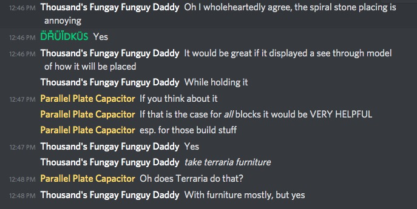
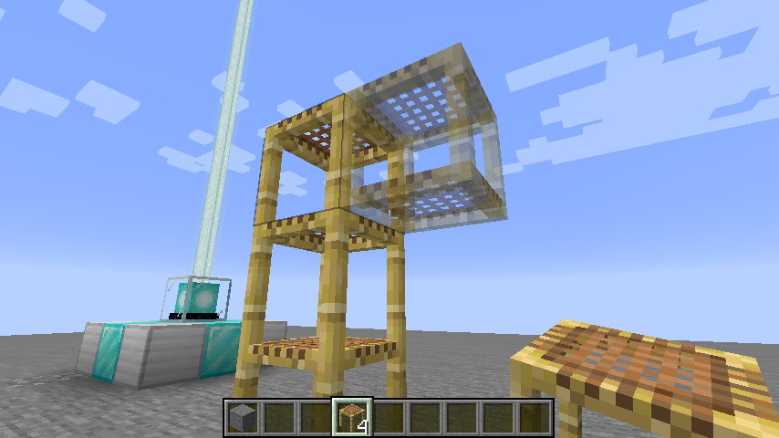

# Placement Preview

… is a Minecraft Mod that lets you know how your block will (probably) be placed beforehand.

The story begins with these chat log in the Twilight Forest Discord, #general channel.

## Screenshot

Notice that this mod also correctly handles variants of the scaffold.

